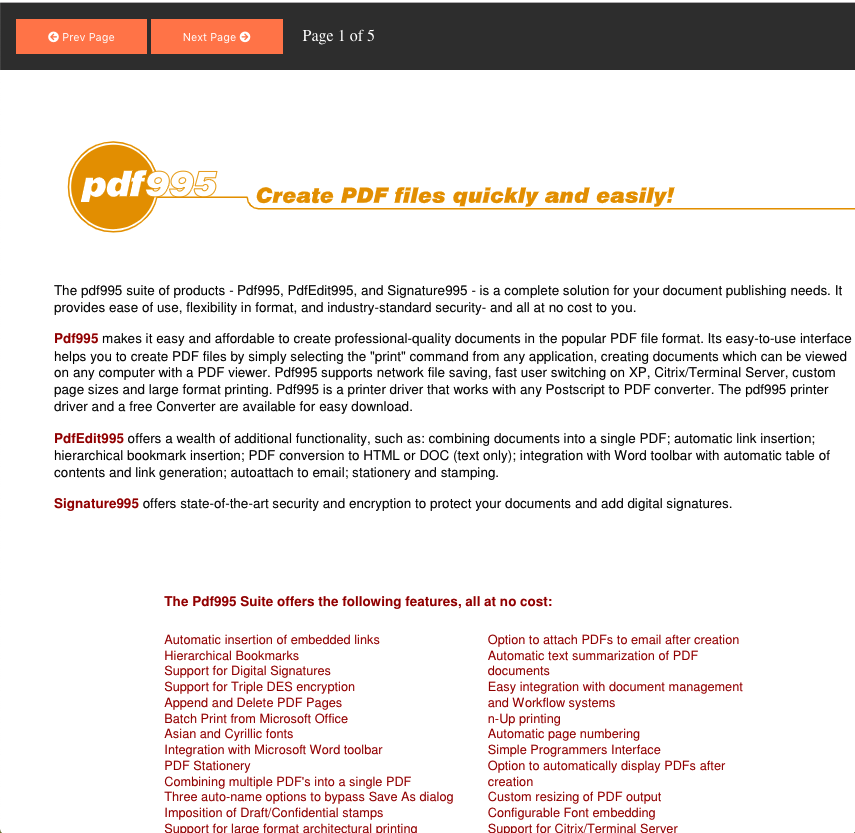

# pdf viewer with JavaScript

A pdf viewer built with JavaScript using PDF.js (https://github.com/mozilla/pdf.js)

If the viewer can't find the pdf an error message is thrown.

Bootstrap is used for styling.

## A screenshot

On desktop

## Author
* Albert Stjärne (https://github.com/AlbertStjarne)